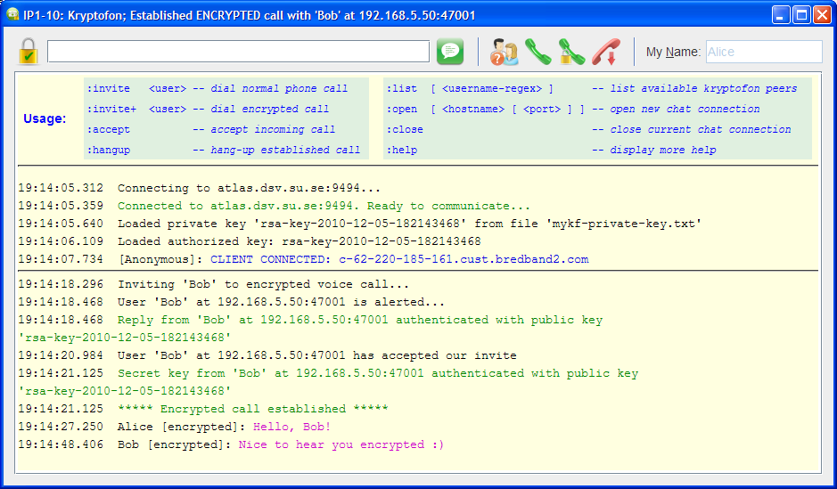

# Kryptofon - A secure voice over IP phone

Kryptofon is a Java based application for a secured voice and short message communication between the internet users. 
The full documentation is [here](https://mekeetsa.github.io/kryptofon).

